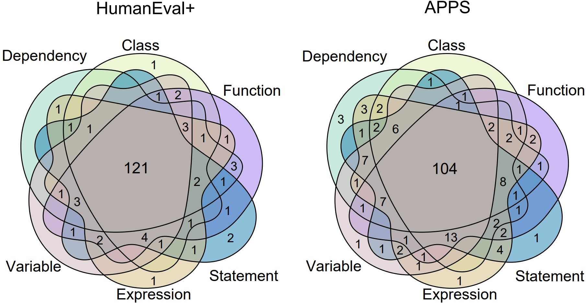
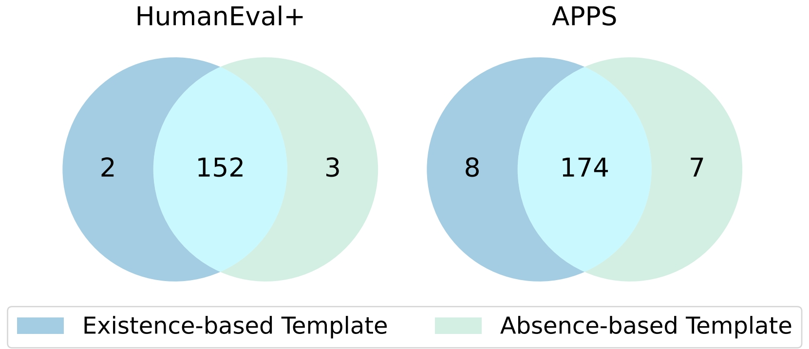
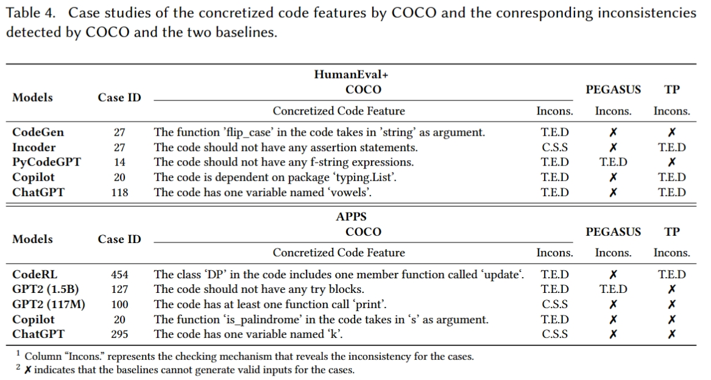

# COCO
This is the repository of our paper: Robustness Testing of Code Generation Systems via Concretizing Instructions

## Configuration

Create a Python 3.10 environment using conda and install the packages in `requirements.txt`

> conda create -n py310 python=3.10
>
> conda activate py310
>
> pip install -r requirements.txt

## Run

There are three main scripts in COCO: 

1. Run `fuzzing.py` to generate concretized inputs for code generation systems

> python -u fuzzing.py --dataset humaneval --network codegen-350M-multi

The results will be saved in `results/fuzzing_{date}_mix/humaneval_codegen-350M-multi/our`

2. Run `fuzzing_baseline.py` to run the baselines

> python -u fuzzing_baseline.py --dataset humaneval --network codegen-350M-multi

The results will be saved in `results/new_fuzzing_baselines_{date}_mix/{baseline}/humaneval_codegen-350M-multi`. All test inputs generated by the baselines have been generated and saved in advance at path`./attacks/`

3. Run `fuzzing_high_order.py` to generate high-order concretizations

> python -u fuzzing_high_order.py --dataset humaneval --network codegen-350M-multi -k 3

Since the invocation of ChatGPT  is different from other pre-trained models, it should be run with scripts `openai_fuzzing.py` and `openai_fuzzing_baselines.py`

## Overlaps among different code features

## Overlaps among the two types of templates

### Case Study

